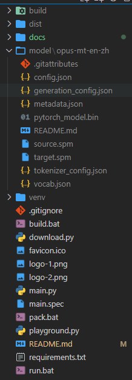

<p align="center">
    
</p>

<div align="center">
</div>
 
# Introduction

This is a NLP API server.

# Usage

- download it from [Github Release](https://github.com/rerender2021/NLP-API/releases).

- unzip it, and click `run.bat`.

# API

- default host: `http://localhost:8100`
  
## POST /translate

- description: offline translation
- example:


# Dev

- install

```bash
> virtualenv venv --python=python3.8.10
> pip install -r requirements.txt
```

- download model

```bash
> python download.py
```

Then, adjust `model` folder structure like this:



- run

```bash
> python main.py
```

# Package

- build: `build.bat`
- pack: `pack.bat`
- test: cd `dist/NLP-API`, click `run.bat`

# License

[MIT](./LICENSE)
