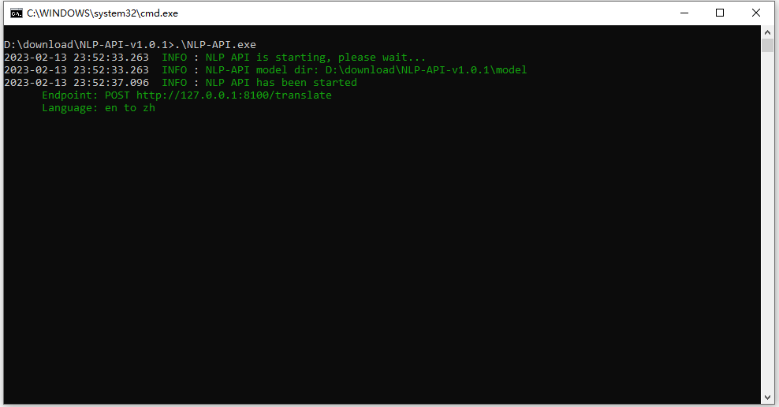

<p align="center">
    
</p>

<div align="center">
</div>
 
# Introduction

This is a NLP API server.

# Usage

- Download it from [release](https://github.com/rerender2021/NLP-API/releases)

- Unzip it, and click `run.bat`



# API

- Default host: `http://localhost:8100`
  
## POST /translate

- Description: offline translation
- Example:


# Dev

- Install

```bash
> virtualenv venv --python=python3.8.10
> pip install -r requirements.txt
```

- Download model

```bash
> python ./script/download.py
```

Then, adjust `model` folder structure like this:

```
- ...
- model
    - opus-mt-en-zh
- ...
- README.md
```

- Run

```bash
> python ./src/main.py
```

# Package

```bash
> build
```

# License

[MIT](./LICENSE)
